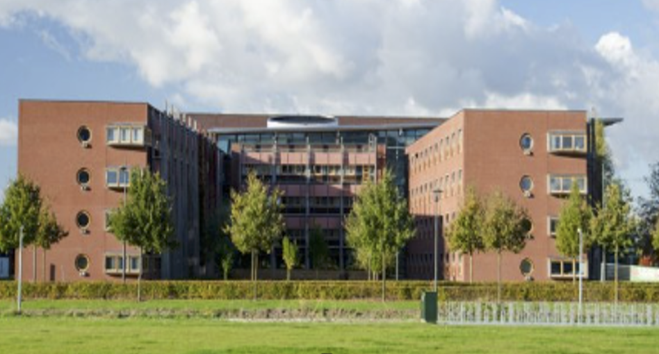
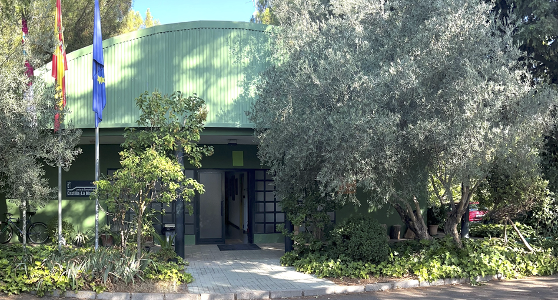
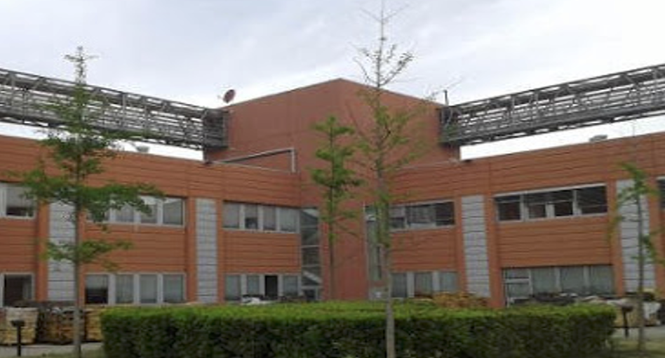

<div class="section-label">Section · Consortium</div>

## Partners & roles

HYDRA-EO is coordinated by Wageningen University and brings together complementary expertise
in Earth Observation services, radiative transfer modelling, plant pathology, genetics, and agronomy from the Netherlands, Italy, and Spain. The consortium covers the full chain from field experimentation to EO-based modelling, hybrid machine learning, and dissemination.


::: {.card-grid .card-grid-2}

::: {.vbl-card}
<div class="pill-mini">Coordination · NL</div>

### Wageningen University & Research (WU-DES)

The Geoinformation Science and Remote Sensing (GRS) group leads overall project coordination and
Work Packages WP1, WP2, WP5, WP6, and WP10. WU-DES develops the RTM and ML core
(<strong>ToolsRTM</strong>, <strong>SCOPEinR</strong>), designs the scientific workflow, and manages the
central Git repositories and Shiny-based tools.

Project coordination is led by <strong>Dr. Carlos Luis Camino González</strong>, with scientific support
from <strong>Prof. Dr. Lammert Kooistra</strong> and colleagues.
:::

::: {.vbl-card}
<div class="pill-mini">Difussion</div>

### Wageningen Environmental Research (WENR)

WENR leads WP8 (Scientific Collaboration) and WP9 (Promotion & Dissemination), and co-leads WP6.
The team specialises in operational EO services, evapotranspiration, and agricultural applications,
and is responsible for stakeholder engagement, outreach activities, and links with ESA platforms
and services.
:::

::: {.vbl-card}
<div class="pill-mini">Modelling · IT</div>

### Consiglio Nazionale delle Ricerche – Institute of BioEconomy (CNR-IBE)

CNR-IBE leads WP3 (Development & Validation), WP4 (Experimental Dataset Generation), and WP7
(Scientific Roadmap). The group coordinates Italian alfalfa and vineyard campaigns, hyperspectral
validation and scaling studies, and contributes to trait retrieval modelling and the long-term
scientific roadmap supporting future ESA missions.
:::

::: {.vbl-card}
<div class="pill-mini">Field trials · ES</div>

### Chaparrillo Agro-Environmental Research Center (CIAG-IRIAF)

CIAG-IRIAF co-leads WP2 and is responsible for pistachio and olive trials in WP4. The centre provides
experimental orchards with controlled inoculation of fungal and bacterial pathogens, conducts UAV
and aircraft-borne campaigns, and integrates agronomic, spectral, and genetic data to support stress
disaggregation and crop resilience studies.
:::

:::

```{=html}
<div class="img-strip">
  <div class="img-frame">
    
    <div class="img-caption">Wageningen University &amp; Research (WUR)</div>
  </div>
  <div class="img-frame">
    
    <div class="img-caption">Chaparrillo Agro-Environmental Research Center</div>
  </div>
  <div class="img-frame">
    
    <div class="img-caption">Consiglio Nazionale delle Ricerche – Institute of BioEconomy (CNR-IBE)</div>
  </div>

</div>

```


::: {.text-center .small .text-secondary .vbl-footer-classic}
::: {.vbl-footer-line}
:::

© 2026 **HYDRA-EO**.  

HYDRA-EO is funded by the European Space Agency (ESA) under the EXPRO+
Tender *“Crop Multiple Stressors, Pests and Diseases”*. Action **1-12684**.  

{.footer-logo} [HYDRA-EO](https://github.com/CCGCAM/HydraEO/)
:::
