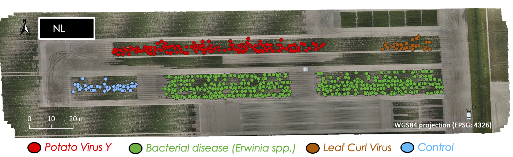

::: {.hero-card}

# Hybrid ML & Earth Observation for multi-stressor crop disease detection

::: {.hero-text}
**HYDRA-EO** is a European Space Agency project that develops an
operational framework to detect, quantify, and differentiate abiotic
and biotic crop stress. The project targets priority plant pathogens,
including *Flavescence Dorée* in grapevine, *Potato Virus Y* in potato,
and fungal diseases such as *Septoria*, while also assessing stress
interactions under variable water and environmental conditions.

HYDRA-EO integrates physically based radiative transfer modelling
approaches with machine learning algorithms to identify the spectral and
spatial resolutions required to capture biotic stress signals
effectively. By combining hyperspectral, thermal, and multi-sensor Earth
Observation data from field, airborne, and satellite platforms, the
project delivers early and reliable indicators to support agricultural
resilience and evidence-based decision-making across Europe.
:::

::: {.hero-tags}
::: {.pill-mini}
Hybrid ML & RTMs
:::
::: {.pill-mini}
Crop stress & pests
:::
::: {.pill-mini}
Hyperspectral & thermal
:::
::: {.pill-mini}
ESA EXPRO+ project
:::
:::

:::

---

::: {.section-label}
Section · Overview
:::

## Understanding crop stress across spectral and spatial scales

HYDRA-EO develops an operational framework to detect, quantify, and
differentiate abiotic and biotic crop stress across multiple spatial and
spectral scales. The project focuses on priority plant pathogens,
including *Flavescence Dorée* in grapevine, *Potato Virus Y* in potato,
and fungal diseases such as *Septoria*, while also assessing interactions
between disease pressure, water stress, and environmental variability.

By integrating physically based radiative transfer modelling approaches
with machine learning algorithms, HYDRA-EO identifies the spectral and
spatial resolutions required to robustly capture biotic stress signals.
The combination of hyperspectral, thermal, and multi-sensor Earth
Observation data from field, airborne, and satellite platforms enables
the delivery of early and reliable indicators to support agricultural
resilience and evidence-based decision-making across Europe.

---

::: {.text-center}
{width=60%}
:::

::: {.img-caption}
Phenotyping potato site
:::

---

::: {.card-grid}

::: {.vbl-card}
::: {.pill-mini}
UAV / airborne
:::

### UAV & airborne processing

Radiometric and geometric correction of UAV and airborne hyperspectral
and thermal data, including mosaicking, BRDF normalisation, and
co-registration with field plots. Output products include surface
reflectance cubes, temperature maps, and quality masks.
:::

::: {.vbl-card}
::: {.pill-mini}
Satellite EO processing
:::

### Satellite EO processing

Sentinel-2, PRISMA, and EnMAP workflows (e.g. Sen2Cor atmospheric
correction, spectral resampling, tiling, and time-series aggregation),
harmonised across sites for crop–stressor analysis and EO upscaling.
:::

::: {.vbl-card}
::: {.pill-mini}
RTM library & hybrid ML
:::

### Hybrid ML methods

PROSAIL and SCOPE forward simulations via **ToolsRTM** and **SCOPEinR**,
LUT generation, plant trait retrieval, and hybrid machine learning models
trained on combined RTM–EO features for crop stress detection.
:::

:::

---

::: {.text-center .small .text-secondary .vbl-footer-classic}
::: {.vbl-footer-line}
:::

© 2026 **HYDRA-EO**.  

HYDRA-EO is funded by the European Space Agency (ESA) under the EXPRO+
Tender *“Crop Multiple Stressors, Pests and Diseases”*. Action **1-12684**.  

{.footer-logo} [HYDRA-EO](https://github.com/CCGCAM/HydraEO/)
:::

