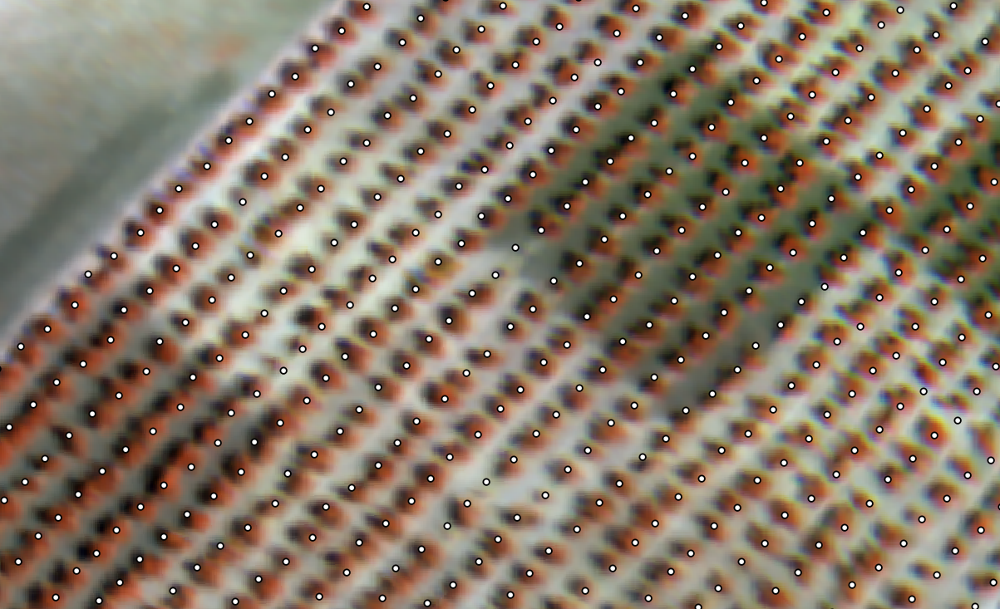

::: {.section-label}
Section · News
:::

## Latest news

Follow the latest HYDRA-EO software releases, project results, scientific
contributions, and dissemination activities.

---

::: {.vbl-card}

### HYDRA-EO 2026: From field measurements to airborne and satellite observations

**27 August 2026 · Campaign update**

HYDRA-EO is building a multi-country, multi-scale dataset through coordinated
field, UAV, airborne, and satellite campaigns in the Netherlands, Spain, and
Italy. Follow the potato, olive, pistachio, and vineyard observations and the
project's collaborations with CERBERUS and regional plant-health partners.

::: {.news-campaign-images}
[{fig-alt="Hyperspectral UAV mosaic of the Lelystad potato experiments"}](news/hydra-eo-campaigns-2026.qmd)
[{fig-alt="Detailed hyperspectral airborne observation at El Chaparrillo"}](news/hydra-eo-campaigns-2026.qmd)
:::

[Read the campaign story](news/hydra-eo-campaigns-2026.qmd){.news-button}

:::

---

::: {.vbl-card}

### RTM-Suite is now available

**27 August 2026 · Open-source software release**

{.rtm-language-badge}
{.rtm-language-badge}

RTM-Suite brings leaf, canopy, soil, and atmosphere radiative transfer
modelling together with sensor convolution and plant-trait inversion in a
single, reproducible R and Python ecosystem. Its documentation includes
31 step-by-step tutorials, interactive applications, and verified examples
for vegetation and Earth Observation research.

[Read the announcement](news/rtm-suite.qmd){.news-button}  
[Explore RTM-Suite](https://ccgcam.github.io/RTM-Suite/){.news-link}

:::

---

## Upcoming conferences & dissemination activities

::: {.vbl-card}

### ICOS Science Conference 2026

**15–17 September 2026 · Lund, Sweden**

Dr. **José Luis Pancorbo** will present two accepted contributions:

- **Abstract 151:** *Assessing PROSAIL Model Performance to Estimate
  Carbon-Based Constituents in Alfalfa*
- **Abstract 233:** *Linking Satellite Observations and ICOS Flux Towers:
  Integrating PRISMA and Sentinel-2 for Ecosystem Productivity Monitoring*

[Conference information](https://www.icos-cp.eu/news-and-events/news/icos-science-conference-2026-held-lund-sweden-15-17-september-2026){.news-button}

:::

---

## Completed conference activities & scientific outputs

::: {.vbl-card}

### Selected papers & abstracts

---

### ESA Digital Twin Earth Components – Open Science Meeting 

**HYDRA-EO: A Digital Twin Component for Multi-Stressor Crop Disease Detection Using Earth Observation, Radiative Transfer Modelling, and Hybrid Machine Learning**  

*ESA Digital Twin Earth Components – Open Science Meeting 2026*  
  
**Presenter:** Dr. Carlos Camino 

This contribution presents HYDRA-EO as a Digital Twin component integrating multi-source Earth Observation data, physically based radiative transfer models, and hybrid machine learning approaches to detect, quantify, and differentiate multiple crop stressors and diseases across agricultural systems.

---
  
### Hyperspectral Remote Sensing and AI in Agriculture international workshop

**Disease detection in potato crop fields using multi-modal sensing approaches from uncrewed aerial vehicles**  

*Hyperspectral Remote Sensing and AI in Agriculture international workshop 2026* 

**Presenter:** Prof. Dr. Lammert Kooistra  

This contribution presents a multi-modal UAV-based approach integrating hyperspectral and complementary sensor data for early disease detection and crop health monitoring in potato fields.

---

### FLEX workshops and FLEX-related contributions

**FLORA – FLEX Leaf Observation and Retrieval via Hybrid Approaches: A Multi-Sensor Framework for Calibration and Validation of FLEX L2B/L2C Products**  

*FLEX Workshop*  

**Presenter:** Dr. Carlos Camino  

A multi-sensor calibration and validation framework integrating UAV hyperspectral imagery, LiDAR, ground-based fluorescence systems, and radiative transfer modelling to support the validation of FLEX L2B/L2C vegetation products across multiple European sites.

**Advancing SIF Retrieval for FLEX: Integrating UAV Hyperspectral, FluorSpec and Radiative Modelling in Potato and Maize Systems**  

*FLEX Workshop* 
  
**Presenter:** Prof. Dr. Lammert Kooistra  
    
Integration of UAV-based hyperspectral data, FluorSpec measurements, and radiative transfer models to improve the retrieval of sun-induced fluorescence and photosynthetic traits in agricultural cropping systems.

---

### EARSeL Workshop on Imaging Spectroscopy (WS IS 2026)

**A Multi-Sensor Inversion Framework for Extracting Photosynthesis-Related Functional Traits in Maize and Potato Cropping Systems**  

*14th EARSeL Workshop on Imaging Spectroscopy (EARSeL WS IS 2026)*  

**Presenter:** Dr. Carlos Camino  

A hybrid inversion framework combining radiative transfer modelling and multi-sensor Earth Observation data to retrieve photosynthesis-related functional traits in maize and potato systems.

---

**Early Detection of Phomopsis Stem Canker in Sunflower Using a Multi-Sensor Approach Integrating Sun-Induced Fluorescence, Crop Water Stress Index, and Radiative Transfer Models**  

*14th EARSeL Workshop on Imaging Spectroscopy (EARSeL WS IS 2026)*  

**Presenter:** Mr. Matteo Sali

Early disease detection using a synergistic combination of SIF, thermal-based crop water stress indicators, and physically based radiative transfer modelling.

---

### IEEE IGARSS 2026

*9–14 August 2026 · Washington, D.C., USA · Completed*

**Monitoring Forest Gross Primary Productivity with Sentinel-2 Using Plant Trait–Based Hybrid Radiative Transfer and Machine Learning Approaches**  

*IEEE International Geoscience and Remote Sensing Symposium (IGARSS 2026)*  

**Presenter:** Dr. Carlos Camino  

A plant trait–driven hybrid framework integrating PROSAIL-based radiative transfer simulations and machine learning to estimate forest gross primary productivity from Sentinel-2 observations.  
[Read the conference paper (PDF)](../docs/conference-template-a4_gpp.pdf){.news-link}

---

**Early Fungal Detection in Pine Forest by Fusing PRISMA and Sentinel-2 with Biophysical Models**  

*IEEE International Geoscience and Remote Sensing Symposium (IGARSS 2026)*  

**Presenter:** Dr. Carlos Camino  

Combined use of hyperspectral PRISMA and multispectral Sentinel-2 data with biophysical modelling to monitor fungal infection dynamics and ecosystem productivity.  
[Read the conference paper (PDF)](../docs/conference-template-SR2_prisma.pdf){.news-link}

:::

---

::: {.quarto-next}
### Continue exploring

[2026 campaign story](news/hydra-eo-campaigns-2026.qmd){.quarto-next-primary}
[Scientific pipeline](pipeline.qmd)
[RTM-Suite tools](tools.qmd)
[Project timeline](timeline.qmd)
:::

::: {.text-center .small .text-secondary .vbl-footer-classic}
::: {.vbl-footer-line}
:::

© 2026 **HYDRA-EO**.  

HYDRA-EO is funded by the European Space Agency (ESA) under the EXPRO+
Tender *“Crop Multiple Stressors, Pests and Diseases”*. Action **1-12684**.  

{.footer-logo width=80px} [HYDRA-EO](https://github.com/CCGCAM/HydraEO/)
:::
