::: {.section-label}
Campaign update · 27 August 2026
:::

::: {.campaign-lead}
During the 2026 growing season, **HYDRA-EO** is carrying out an extensive
series of field, UAV, airborne, and satellite campaigns across Europe to
advance the early detection and monitoring of crop diseases and stress.
:::

The campaigns bring together researchers and partners across the Netherlands,
Spain, and Italy. Hyperspectral, thermal, fluorescence, and RGB observations
are combined with detailed measurements of plant physiology, biochemistry,
crop development, and disease progression.

The objective is to understand how stress and disease modify plant traits and
functioning, and how those changes can be detected consistently from individual
leaves and plants to UAV, aircraft, and satellite observations.

::: {.campaign-scale aria-label="Observation scales connected by HYDRA-EO"}
Plant measurements<b>→</b>Field spectroscopy<b>→</b>UAV<b>→</b>Airborne hyperspectral & thermal<b>→</b>Satellite EO
:::

## Monitoring potato health in the Netherlands

In Lelystad, the **Wageningen University, Department of Environmental Sciences
(WU-DES)** team conducted five HYDRA-EO UAV campaigns between May and July 2026
over experimental potato fields. Flights on **11 May, 16 June, 25 June, 1 July,
and 21 July** followed crop development from early growth through flowering
and early tuber development.

WU-DES coordinated the multi-sensor observations, combining VNIR hyperspectral
imagery, thermal observations, fluorescence and SIF measurements, and RGB
imagery with field disease assessments and plant measurements. Together, they
provide a detailed time series for investigating how disease and physiological
stress evolve during the season.

The final UAV campaign also covered the cloud-free portion of an **EnMAP
hyperspectral satellite acquisition from 19 July**, creating an important
opportunity to compare ground, UAV, and satellite observations.

The experimental design includes multiple potato varieties with contrasting
susceptibility to viral and bacterial diseases, including blackleg and soft
rot caused by *Erwinia* (*Pectobacterium*/*Dickeya*) species. Comparing
variety- and disease-specific plots throughout the season allows the team to
relate visible symptom development to the spectral and thermal signals
captured from the UAV and satellite platforms.

::: {.campaign-gallery .campaign-gallery-feature}
::: {.campaign-photo}
{fig-alt="False-colour hyperspectral UAV mosaic of potato field experiments in Lelystad in June 2026"}

**June hyperspectral campaign.** False-colour UAV mosaic showing the spatial structure of the experimental potato plots.
:::

::: {.campaign-photo}
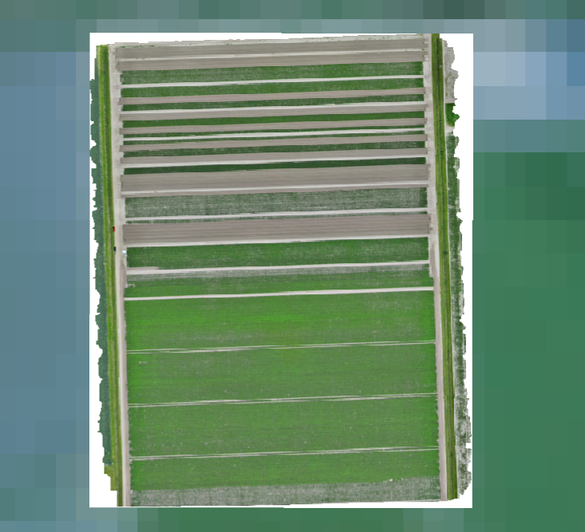{fig-alt="Detailed UAV mosaic of potato experiments in Lelystad on 21 July 2026"}

**21 July UAV acquisition.** High-resolution view of the potato experiment during the final UAV campaign.
:::
:::

::: {.campaign-photo .campaign-photo-wide}
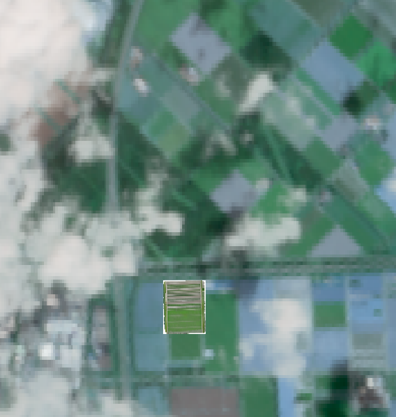{fig-alt="EnMAP satellite context with the Lelystad UAV potato experiment highlighted"}

**Connecting UAV and satellite scales.** The UAV acquisition footprint is shown within the partly cloud-free EnMAP scene acquired on 19 July 2026.
:::

Alongside the airborne and satellite acquisitions, the WU-DES field team
photographs the trial plots on the ground throughout the season. These images
document the different potato varieties and disease treatments side by side,
including the visible contrast between healthy canopy and the early
senescence associated with viral and *Erwinia* infection, and provide the
ground truth needed to interpret the UAV and satellite signals.

::: {.campaign-gallery}
::: {.campaign-photo}
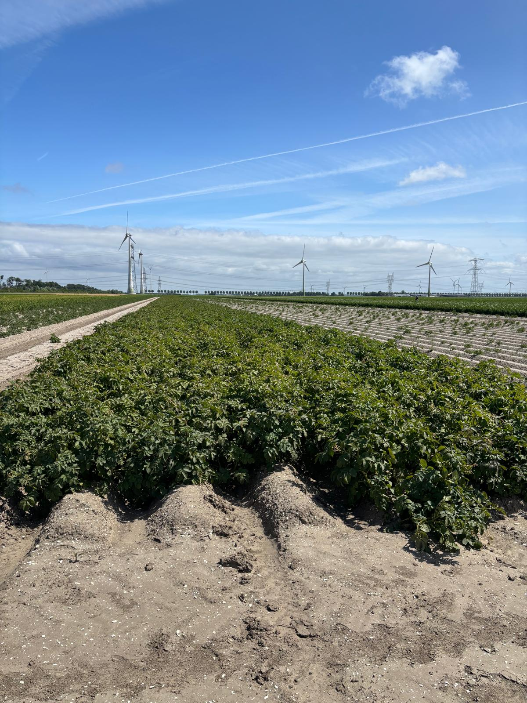{fig-alt="Close-up of young potato plants on ridged rows in an experimental variety and disease trial plot in Lelystad"}

**Early-season trial plots.** Young potato plants on the ridged rows of the multi-variety disease trial, photographed shortly after emergence.
:::

::: {.campaign-photo}
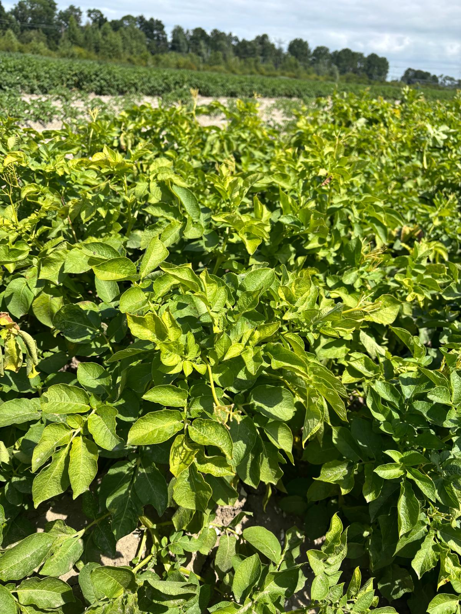{fig-alt="Close-up of potato canopy foliage in an experimental plot in Lelystad, used as ground reference for UAV imagery"}

**Canopy ground reference.** Detailed view of canopy foliage colour and structure, used to interpret the hyperspectral, thermal, and RGB imagery collected overhead.
:::
:::

::: {.campaign-photo .campaign-photo-wide}
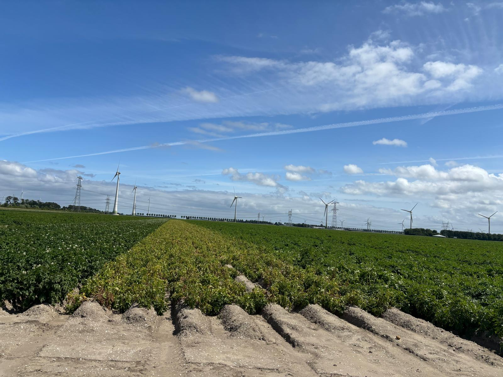{fig-alt="Wide view of potato trial rows in Lelystad showing a row with early canopy senescence next to healthy green rows of different varieties, with wind turbines in the background"}

**Comparing varieties and disease treatments in the field.** A trial row showing early canopy senescence stands out against neighbouring rows of other varieties, illustrating the plot-to-plot contrast in disease response that the UAV and satellite sensors are designed to detect.
:::

::: {.campaign-photo .campaign-photo-wide}
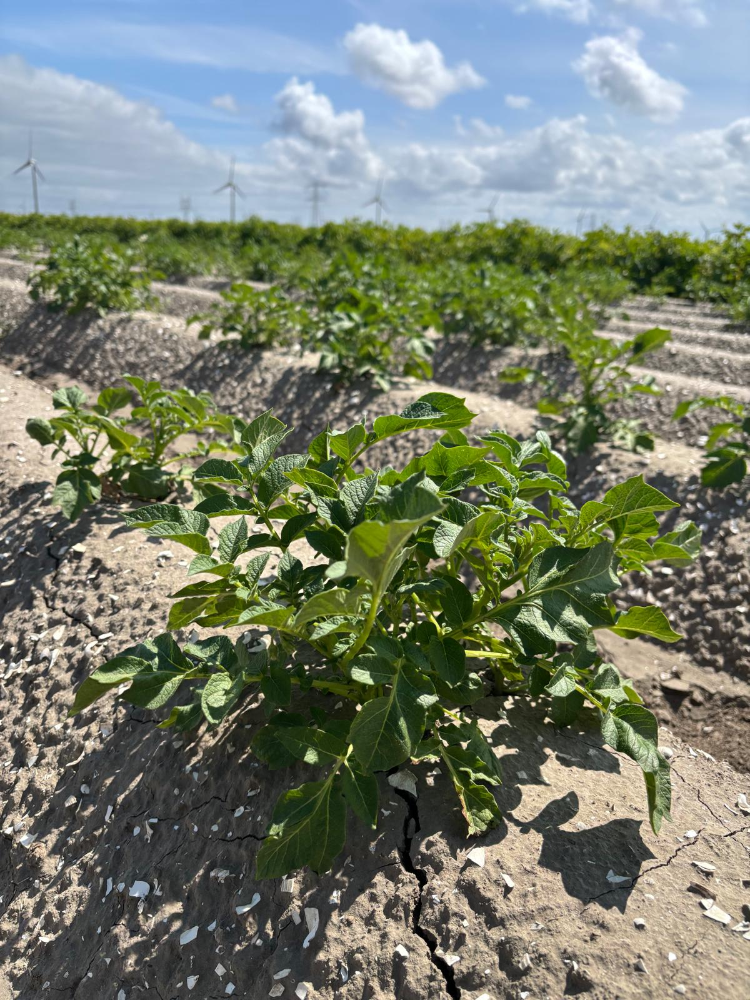{fig-alt="Wide view of potato trial rows in Lelystad on a later visit, showing continued plot-to-plot variation between varieties"}

**Repeated ground documentation.** Photographs taken across successive field visits track how canopy condition evolves differently between varieties and disease treatments as the season progresses.
:::

## Airborne monitoring of olive and pistachio in Spain

At **El Chaparrillo in Ciudad Real**, HYDRA-EO is conducting repeated airborne
and field campaigns over olive and pistachio orchards. A first major campaign
was completed in June 2026, combining aircraft observations, extensive field
measurements, and an EnMAP hyperspectral satellite acquisition.

A second major campaign is scheduled for **31 August-5 September 2026**. The
aircraft will simultaneously acquire VNIR and SWIR hyperspectral imagery and
thermal observations, while teams on the ground collect complementary spectral,
physiological, biochemical, and disease-related measurements.

The pistachio experiments include trees affected by different fungal diseases.
This creates an opportunity to investigate whether combinations of
hyperspectral and thermal observations can separate disease-related changes
from other sources of plant variability. Repeated measurements are essential:
the challenge is not only to identify symptomatic plants, but to determine when
physiological changes first become detectable.

::: {.campaign-gallery}
::: {.campaign-photo}
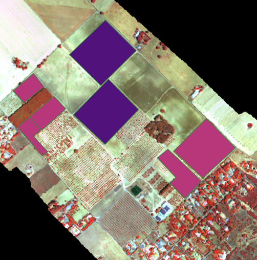{fig-alt="Airborne hyperspectral mosaic covering experimental fields and orchards at El Chaparrillo on 12 June 2026"}

**El Chaparrillo campaign area.** Airborne coverage of the agricultural experiments and surrounding orchards on 12 June 2026.
:::

::: {.campaign-photo}
{fig-alt="Detailed airborne view of orchard tree crowns at El Chaparrillo with sampling locations"}

**From orchard to individual crowns.** Detailed imagery supports the connection between tree-level reference measurements and airborne signals.
:::
:::

## Following disease development in Italian vineyards

Since **June 2026**, HYDRA-EO has been running a series of campaigns in
Italian vineyards and at an alfalfa reference site, combining airborne
VNIR-SWIR hyperspectral and thermal observations with field spectroscopy and
physiological measurements. A coordinated campaign with **CNR-IBE** in the
Bologna region in early August 2026 captured vineyards under different health
conditions, building on measurements collected since the start of the growing
season.

A further measurement campaign in **early September 2026** targets vineyards
affected by *Flavescence dorée*, continuing the repeated observations carried
out since June. These repeated observations help determine how disease
affects canopy spectral properties, temperature, and plant functioning, and
whether these signals remain detectable when moving from individual plants to
larger spatial scales.

Airborne acquisitions are carried out in partnership with the **Institute of
BioEconomy of the Italian National Research Council (CNR-IBE)**, who operate a
Headwall sensor system combining VNIR-SWIR hyperspectral imaging with a LiDAR
scanner on a UAV platform. Flying this combined sensor package makes it
possible to relate canopy spectral signals directly to three-dimensional
canopy structure. In parallel, field teams collect spectroradiometer
measurements directly on the vine canopy in the Chianti hills, providing the
ground reference spectra needed to interpret the airborne imagery.

A permanently installed **FloX system**, powered by solar panels and sited in
a reference alfalfa field, continuously records canopy reflectance and
solar-induced fluorescence throughout the season. This automated station
complements the vineyard campaigns with a long-term, weather-independent
calibration and validation record. Compact UAV-mounted hyperspectral sensors
are also being trialled during the July 2026 field campaign, extending the
observation chain between handheld field instruments and full airborne
acquisitions.

::: {.campaign-gallery}
::: {.campaign-photo}
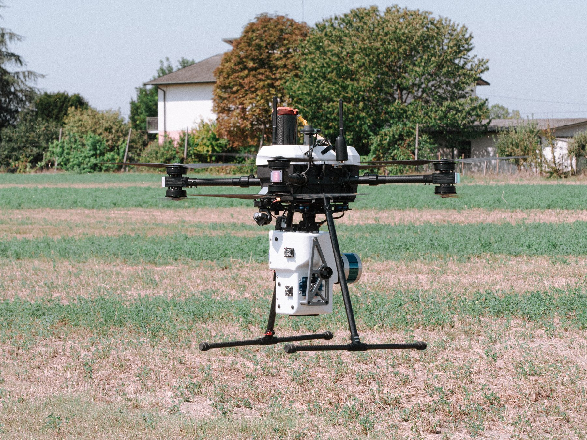{fig-alt="Headwall VNIR-SWIR hyperspectral and LiDAR sensor system mounted on a UAV, operated by CNR-IBE"}

**Headwall VNIR-SWIR + LiDAR sensor.** Operated by CNR-IBE, this UAV-mounted system combines hyperspectral imaging with LiDAR to link canopy spectra with 3D structure.
:::

::: {.campaign-photo}
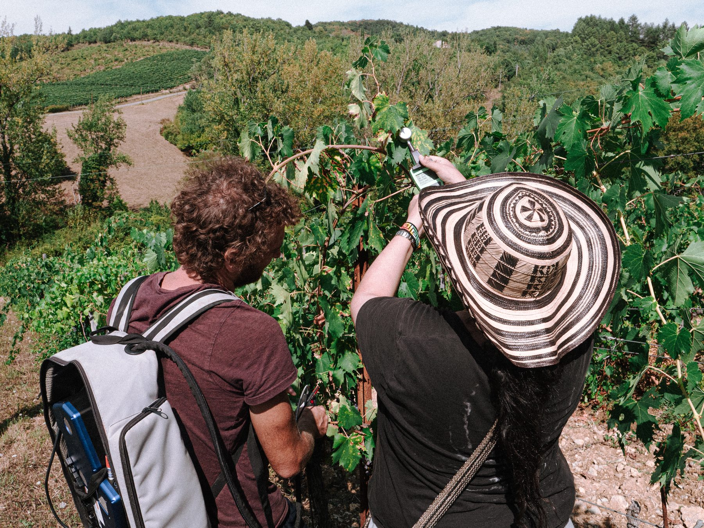{fig-alt="Field team taking spectroradiometer measurements on grapevine canopy in the Chianti hills"}

**Field spectroscopy in Chianti.** Ground-based spectroradiometer measurements on vine canopies provide reference spectra for the airborne Headwall acquisitions.
:::
:::

::: {.campaign-photo .campaign-photo-wide}
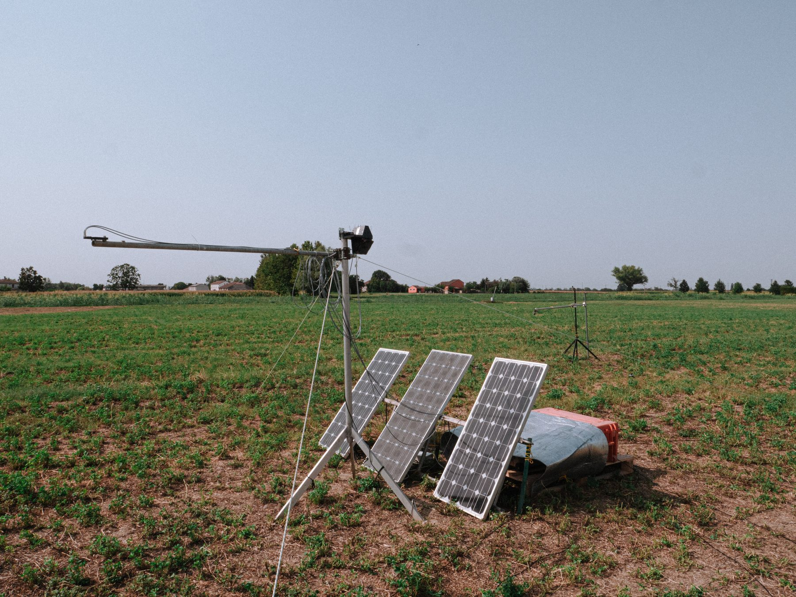{fig-alt="Solar-powered FloX automated fluorescence and reflectance system installed in an alfalfa reference field in Italy"}

**Continuous monitoring with FloX.** A solar-powered FloX station installed in a reference alfalfa field records canopy reflectance and solar-induced fluorescence throughout the season, providing a long-term calibration and validation record for the Italian campaigns.
:::

::: {.campaign-gallery}
::: {.campaign-photo}
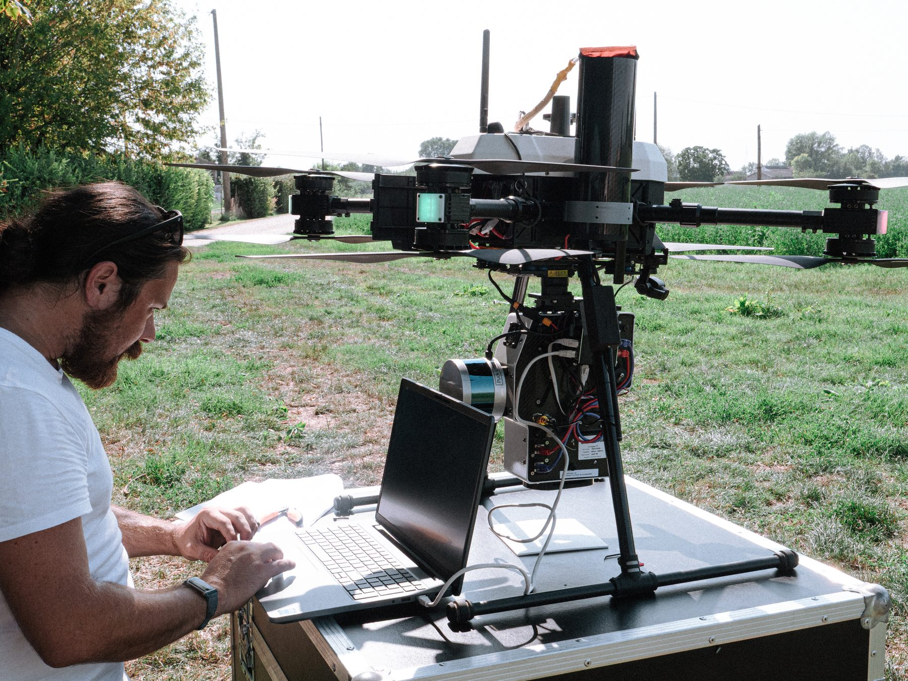{fig-alt="Compact hyperspectral nano sensor payload being prepared for a UAV flight during the Italy field campaign"}

**Compact hyperspectral payload.** A lightweight, UAV-mounted "nano" hyperspectral sensor being prepared for flight, extending coverage between field and full airborne scales.
:::

::: {.campaign-photo}
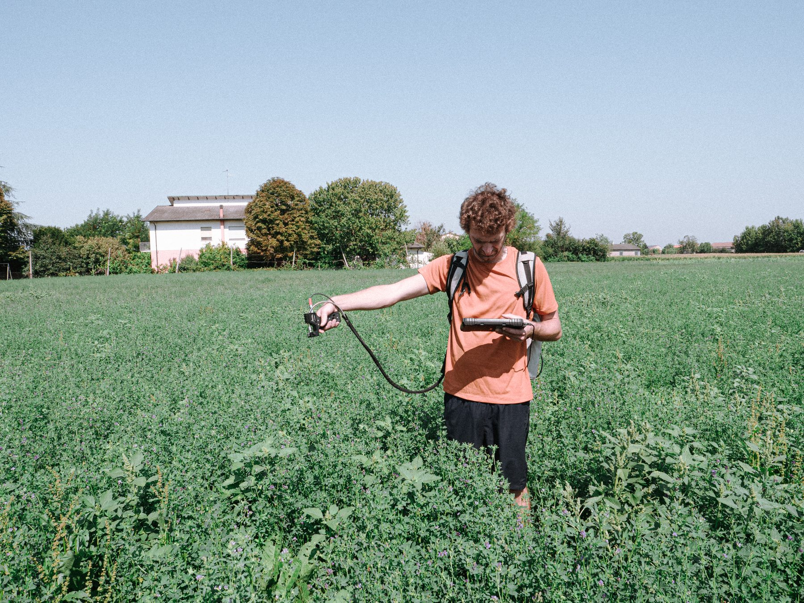{fig-alt="CNR-IBE field team member taking spectral measurements in a crop field during the July 2026 Italy campaign"}

**Field campaign, July 2026.** A CNR-IBE colleague collecting field spectral measurements as part of the Italian campaign season.
:::
:::

## Expanding observations through European collaboration

HYDRA-EO works with complementary European projects, research institutes, and
regional plant-health services to extend observations beyond its core sites and
test methods under real disease-management conditions.

In Italy, collaboration with the **CERBERUS project** and **CNR-IBE (Institute
of BioEconomy, Italian National Research Council)** in Bologna supports
repeated monitoring of vineyards affected by *Flavescence dorée*. The
campaigns carried out since June, including the early-August and
early-September acquisitions, provide observations under different seasonal
and physiological conditions.

In Valencia, HYDRA-EO collaborates with CERBERUS and the **Servicio de Sanidad
Vegetal of the Generalitat Valenciana**. Airborne observations cover olive
orchards and other priority areas identified by plant-health authorities,
including sites relevant to the surveillance of insect vectors associated with
*Xylella fastidiosa*. This connects advanced Earth Observation technologies
with operational plant-health surveillance.

Building on this, **CNR-IBE**, together with **Wageningen University,
Department of Environmental Sciences (WU-DES)**, is planning a further
CERBERUS airborne mission for **late September 2026** over areas affected by
*Xylella fastidiosa*, carried out in collaboration with **CEU Cardenal Herrera
University**. This mission extends CERBERUS Earth Observation testing to an
additional vector-borne disease system, linking the Italian and Spanish arms
of the project.

::: {.campaign-photo .campaign-photo-wide}
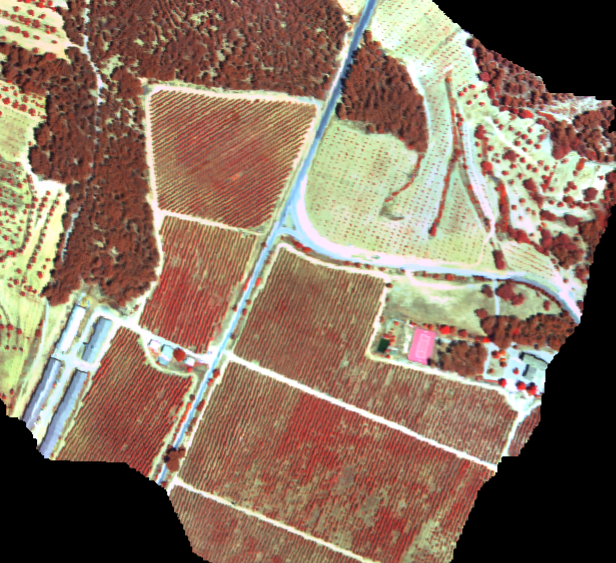{fig-alt="Airborne hyperspectral mosaic of agricultural monitoring sites in Valencia on 3 July 2026"}

**Valencia collaboration.** Airborne observations extend HYDRA-EO testing to additional crops, landscapes, and operational plant-health priorities.
:::

The El Chaparrillo campaigns are conducted by **Wageningen University,
Department of Environmental Sciences (WU-DES)** in collaboration with
**CIAG-IRIAF** and **IAS-CSIC**. The partnership combines WU-DES expertise in
airborne and satellite Earth Observation with crop pathology, field
experimentation, and plant physiology. Together, the partners provide the
reference information needed to interpret hyperspectral and thermal signals
from olive and pistachio systems.

Together, these collaborations expand HYDRA-EO across crops, diseases,
environmental conditions, and monitoring frameworks. They also provide
independent datasets for testing whether methods developed at individual sites
can transfer across locations, sensors, and disease systems.

## Connecting observations across scales

The 2026 campaigns are creating one of HYDRA-EO's core experimental datasets.
By connecting plant measurements, field spectroscopy, UAV observations,
airborne hyperspectral and thermal imagery, and satellite Earth Observation,
the project can investigate the same biological processes at complementary
spatial scales.

These observations will support the development and validation of approaches
that combine radiative transfer modelling, plant physiological information,
and artificial intelligence to detect crop stress and disease while explaining
the underlying changes in plant functioning.

The campaign season will conclude with the late-summer acquisitions in Spain
and Italy, completing a unique multi-country dataset for the next stages of
HYDRA-EO research and development.

::: {.quarto-next}
### Continue exploring

[Scientific pipeline](../pipeline.qmd){.quarto-next-primary}
[RTM-Suite tools](../tools.qmd)
[Project timeline](../timeline.qmd)
[All project news](../news.qmd)
[Consortium](../consortium.qmd)
:::

---

::: {.text-center .small .text-secondary .vbl-footer-classic}
::: {.vbl-footer-line}
:::

© 2026 **HYDRA-EO**.  

HYDRA-EO is funded by the European Space Agency (ESA) under the EXPRO+
Tender *“Crop Multiple Stressors, Pests and Diseases”*. Action **1-12684**.  

{.footer-logo width=80px} [HYDRA-EO](https://github.com/CCGCAM/HydraEO/)
:::
