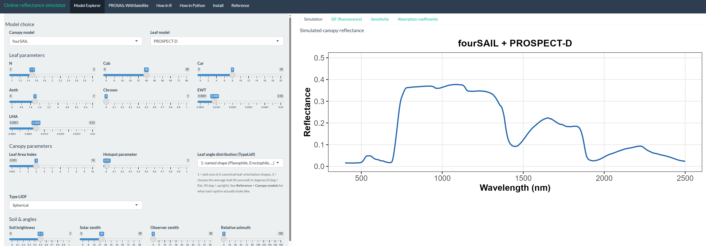

::: {.section-label}
Software release · 27 August 2026
:::

::: {.rtm-article-badges aria-label="Available for R and Python"}
{.rtm-language-badge}
{.rtm-language-badge}
:::

::: {.press-lead}
The **Virtual Biophysical Lab** at Wageningen University & Research has
released **RTM-Suite**, an open-source framework that brings radiative
transfer modelling, sensor simulation, and plant-trait retrieval together
in a consistent R and Python ecosystem.
:::

{fig-alt="Comparison of fourSAIL, foursail2 and INFORM canopy simulations across five leaf radiative transfer models" fig-cap="RTM-Suite connects leaf and canopy radiative transfer models in a common, cross-language framework."}

## From leaf optics to Earth Observation

Radiative transfer models provide the physical link between vegetation
properties and the spectral signals measured by field instruments,
airborne systems, and satellites. RTM-Suite makes this modelling chain
easier to use, compare, and reproduce. It combines models of leaf optics,
canopy structure, soil moisture, atmosphere, energy balance, and
sun-induced chlorophyll fluorescence within one documented environment.

The suite currently brings together five complementary packages and
libraries:

- **ToolsRTM** and **toolsrtm** for leaf and canopy optical modelling,
  sensor convolution, spectral indices, and trait inversion;
- **SCOPEinR** and **scopeinpython** for the SCOPE energy-balance,
  photosynthesis, and fluorescence model; and
- **ToolsRTM.app**, a collection of interactive applications that makes
  the models accessible through point-and-click workflows.

Implementations in R and Python are kept numerically aligned and verified
against one another. Researchers can therefore choose the language that
best fits their workflow while working from a shared physical foundation.

::: {.press-quote}
**One connected research environment.** RTM-Suite supports the full path
from forward simulation to the inversion of Earth Observation data.
:::

## Learn through reproducible tutorials

RTM-Suite is accompanied by **31 step-by-step tutorials** in R and Python.
They range from first simulations with PROSPECT and fourSAIL to advanced
workflows for SCOPE, sensor convolution, look-up tables, machine-learning
inversion, and satellite data access. The tutorials include figures
generated by code that users can run and adapt themselves.

::: {.press-gallery}
::: {.press-gallery-item}
{fig-alt="Interactive RTM-Suite application for radiative transfer model simulation"}

Interactive applications provide an accessible route into model simulation,
sensitivity analysis, inversion, and satellite workflows.
:::

::: {.press-gallery-item}
{fig-alt="SCOPE simulations showing reflectance spectra and sun-induced fluorescence response to chlorophyll content"}

A tutorial example exploring canopy reflectance and sun-induced fluorescence
responses across a chlorophyll gradient.
:::
:::

## Supporting HYDRA-EO's open-science approach

Radiative transfer modelling is central to HYDRA-EO's hybrid approach to
crop-stress detection. Physically based simulations help interpret spectral,
thermal, and fluorescence observations and support machine-learning models
that remain connected to plant traits and processes. RTM-Suite provides an
open and reusable foundation for this work, while also serving the wider
vegetation remote-sensing community.

The software is developed through collaboration between the Laboratory of
Geo-information Science and Remote Sensing at Wageningen University &
Research and CNR-IBE in Florence, Italy, as part of the Virtual Biophysical
Lab.

::: {.press-actions}
[Explore RTM-Suite](https://ccgcam.github.io/RTM-Suite/){.press-primary}
[View the source code](https://github.com/CCGCAM/RTM-Suite){.press-secondary}
[Browse the R tutorials](https://ccgcam.github.io/RTM-Suite/tutorials-overview.html){.press-secondary}
[Browse the Python tutorials](https://ccgcam.github.io/RTM-Suite/tutorials-python.html){.press-secondary}
:::

---

::: {.text-center .small .text-secondary .vbl-footer-classic}
::: {.vbl-footer-line}
:::

© 2026 **HYDRA-EO**.  

HYDRA-EO is funded by the European Space Agency (ESA) under the EXPRO+
Tender *“Crop Multiple Stressors, Pests and Diseases”*. Action **1-12684**.  

{.footer-logo width=80px} [HYDRA-EO](https://github.com/CCGCAM/HydraEO/)
:::
