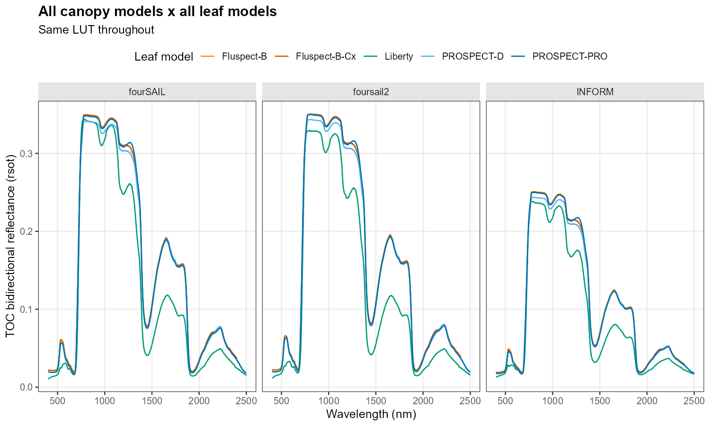
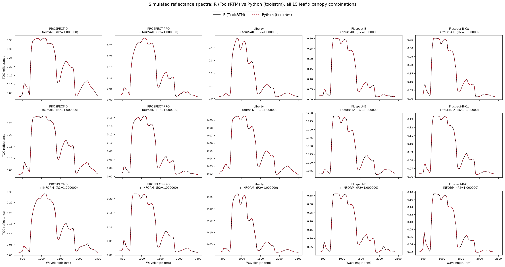
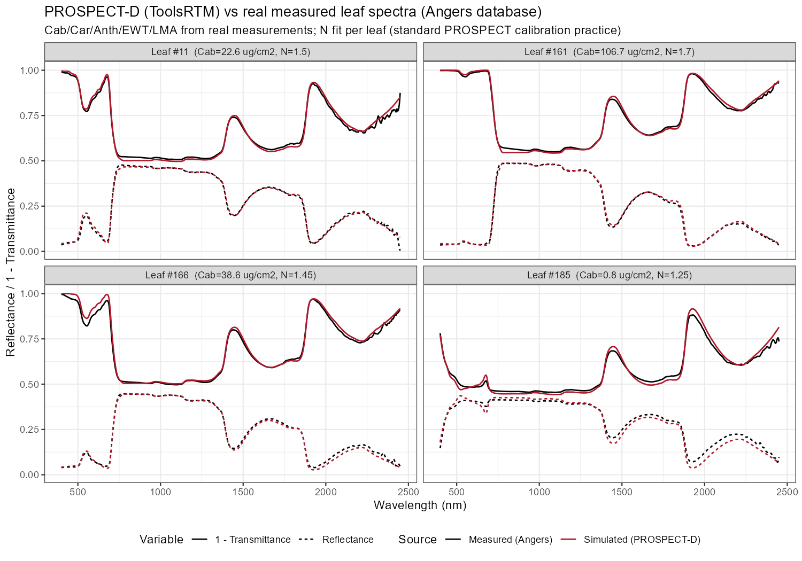
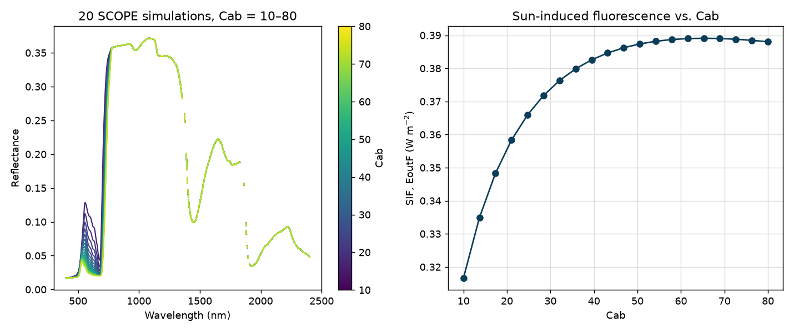
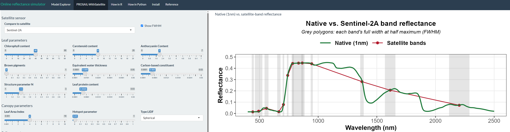

::: {.tools-hero}
::: {.tools-hero-copy}
::: {.section-label}
HYDRA-EO open modelling ecosystem
:::

# RTM-Suite tools for vegetation and Earth Observation

**RTM-Suite** connects leaf, canopy, soil, and atmosphere radiative transfer
models with sensor convolution and plant-trait inversion. The framework offers
aligned implementations in **R and Python**, interactive applications, reference
documentation, and reproducible tutorials.

::: {.tools-hero-badges aria-label="Available for R and Python"}
{.rtm-language-badge}
{.rtm-language-badge}
:::

::: {.tools-actions}
[Open RTM-Suite](https://ccgcam.github.io/RTM-Suite/){.tools-primary}
[Source on GitHub](https://github.com/CCGCAM/RTM-Suite){.tools-secondary}
:::
:::

::: {.tools-hero-visual}
{fig-alt="Comparison of canopy simulations across five leaf radiative transfer models"}

Leaf-to-canopy model comparison across the RTM-Suite framework.
:::
:::

::: {.tools-menu aria-label="Tools page menu"}
[Packages](#packages)
[Models & capabilities](#models)
[Interactive apps](#apps)
[Tutorials](#tutorials)
:::

::: {.section-label}
Packages & libraries
:::

## Five components, one modelling framework

Choose the language and level of interaction that best match your workflow.
The R and Python implementations are developed and numerically verified as a
connected ecosystem.

::: {.tools-package-grid}
::: {.tools-package-card}
{.rtm-language-badge}

### ToolsRTM

Leaf and canopy optics with PROSPECT, Liberty, Fluspect, fourSAIL, foursail2,
and INFORM; soil modelling with MARMIT; sensor convolution; and trait inversion
with classical machine learning and deep learning.

[Package repository](https://gitlab.com/caminoccg/toolsrtm){.tools-card-link}
:::

::: {.tools-package-card}
{.rtm-language-badge}

### SCOPEinR

R implementation of SCOPE 2.0 for soil-canopy radiative transfer,
photosynthesis, surface energy balance, thermal emission, and sun-induced
chlorophyll fluorescence.

[Package repository](https://gitlab.com/caminoccg/scopeinr){.tools-card-link}
:::

::: {.tools-package-card}
{.rtm-language-badge}

### ToolsRTM.app

Nine interactive applications for PROSAIL, BRDF, MARMIT, SPART, SCOPE,
look-up tables, RTM comparison, trait inversion, and STAC satellite workflows.

[Application source](https://github.com/CCGCAM/RTM-Suite/tree/main/ToolsRTM.app){.tools-card-link}
:::

::: {.tools-package-card}
{.rtm-language-badge}

### toolsrtm

Python library for leaf and canopy simulation, real-soil modelling, spectral
indices, sensor convolution, machine-learning inversion, deep learning, and
STAC-based satellite data retrieval.

[Library repository](https://github.com/CCGCAM/ToolsRTMinPython){.tools-card-link}
:::

::: {.tools-package-card}
{.rtm-language-badge}

### scopeinpython

Python implementation of SCOPE for coupled optical, thermal, biochemical,
energy-balance, photosynthesis, and fluorescence simulations.

[Library repository](https://github.com/CCGCAM/SCOPEinPython){.tools-card-link}
:::
:::

::: {.section-label}
Models & capabilities
:::

## From leaf constituents to satellite observations

::: {.tools-capability-grid}
::: {.tools-capability}
**Leaf optics**

PROSPECT-D, PROSPECT-PRO, Liberty, Fluspect-B, and Fluspect-Cx.
:::

::: {.tools-capability}
**Canopy reflectance**

fourSAIL, foursail2, INFORM, and coupled PROSAIL workflows.
:::

::: {.tools-capability}
**Soil & atmosphere**

MARMIT wet-soil modelling and SPART soil-plant-atmosphere radiative transfer.
:::

::: {.tools-capability}
**Plant functioning**

SCOPE energy balance, photosynthesis, thermal emission, and fluorescence.
:::

::: {.tools-capability}
**Sensor simulation**

Spectral convolution to multispectral and hyperspectral EO sensor responses.
:::

::: {.tools-capability}
**Trait inversion**

Look-up tables, 12 classical ML algorithms, neural networks, and deep learning.
:::
:::

::: {.tools-figure-wide}
{fig-alt="Spectral comparison of the leaf and canopy radiative transfer models available in RTM-Suite"}

RTM-Suite provides a common environment for comparing model families and spectral responses.
:::

::: {.tools-figure-pair}
::: {.tools-figure-card}
{fig-alt="Validation examples for PROSPECT-D leaf reflectance and transmittance simulations"}

**Verified model behaviour.** PROSPECT-D validation examples against reference spectra.
:::

::: {.tools-figure-card}
{fig-alt="SCOPE simulation of canopy reflectance and sun-induced fluorescence across chlorophyll values"}

**Coupled processes.** SCOPE simulations connect canopy reflectance with sun-induced fluorescence.
:::
:::

::: {.section-label}
Interactive applications
:::

## Explore the models without writing code

ToolsRTM.app provides point-and-click interfaces for simulations, sensitivity
analysis, look-up tables, inversion, and satellite workflows. The applications
support teaching, rapid exploration, and the preparation of reproducible model
experiments.

::: {.tools-figure-pair}
::: {.tools-figure-card}
{fig-alt="RTM-Suite interactive sensitivity-analysis application"}

**Sensitivity analysis.** Explore how vegetation traits and observation geometry affect spectra.
:::

::: {.tools-figure-card}
{fig-alt="RTM-Suite application for accessing and analysing satellite observations"}

**Satellite workflows.** Connect model-based analysis with EO observations and STAC catalogues.
:::
:::

[Explore the interactive applications](https://ccgcam.github.io/RTM-Suite/#apps){.tools-primary}

::: {.section-label}
Learn & reproduce
:::

## Tutorials, manuals, and runnable examples

RTM-Suite includes **31 step-by-step tutorials** with figures generated from
working code. The learning paths cover first simulations, model comparison,
sensitivity analysis, sensor convolution, SCOPE, look-up tables, trait
inversion, and satellite data access.

::: {.tools-learning-grid}
::: {.tools-learning-card}
{.rtm-language-badge}

### R learning path

Tutorials for ToolsRTM and SCOPEinR, grouped by topic and level.

[Browse R tutorials](https://ccgcam.github.io/RTM-Suite/tutorials-overview.html){.tools-card-link}
:::

::: {.tools-learning-card}
{.rtm-language-badge}

### Python learning path

Tutorials for toolsrtm and scopeinpython, from core simulations to inversion.

[Browse Python tutorials](https://ccgcam.github.io/RTM-Suite/tutorials-python.html){.tools-card-link}
:::

::: {.tools-learning-card}
::: {.pill-mini}
Reference
:::

### Documentation

Package manuals, function references, installation guidance, and tested code examples.

[Open documentation](https://ccgcam.github.io/RTM-Suite/#docs){.tools-card-link}
:::
:::

::: {.text-center .small .text-secondary .vbl-footer-classic}
::: {.vbl-footer-line}
:::

© 2026 **HYDRA-EO**.  

HYDRA-EO is funded by the European Space Agency (ESA) under the EXPRO+
Tender *“Crop Multiple Stressors, Pests and Diseases”*. Action **1-12684**.  

{.footer-logo width=80px} [HYDRA-EO](https://github.com/CCGCAM/HydraEO/)
:::
